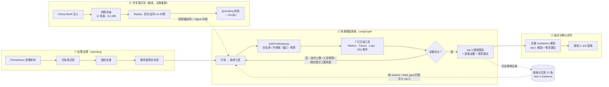

# Kubernetes 事故调查 Agent（Event-driven SRE Agent）

告警驱动的值班 Agent：**告警治理 → 自动调查 → 多源根因定位 → 修复建议送达企微 → ack 确认闭环**——可评测、可审计、刻意止步于自动修复（只诊断，不执行变更）。

技术栈：`LangGraph` · `OpenTelemetry` · `Kubernetes` · `Prometheus / Loki / Tempo` · `Chaos Mesh` · `Alertmanager` · `deepseek`

---

## 项目介绍

在真实 Kubernetes 微服务集群（OpenTelemetry Astronomy Shop，15 微服务）上落地的 **SRE 事故诊断 Agent**：由 Prometheus 告警自动触发调查，Agent 跨 Metrics / Traces / Logs / K8s 事件多源取证，输出**带证据链的 top-3 根因假设与可执行修复建议**，经企业微信送达值班人，并留有确认（ack）闭环。

它要解决的问题是值班现实中最耗时的一环：**告警响了之后，从"哪个服务坏了"到"为什么坏"的那段时间**。Agent 把这段从人工翻看多个可观测性系统的过程，变成一次 30 秒左右、每条结论都可回溯的自动调查。

三个贯穿设计的工程属性：

| 属性 | 说明 |
|---|---|
| **可复现** | 11 个真实故障场景的遥测快照全量入库——`git clone` 后**无需重新采集集群**即可跑完整评测（`make demo-all`，约 4 分钟 / $0.02）；同 run 四方法（Agent / Z-score / Composite Z / Random）对照，方法学上可比 |
| **可审计** | 每次工具调用（ALLOW / DENY / CLAMP）与每条结论的证据引用全量落盘；grounding 校验要求结论可回溯到真实工具输出，幻觉结论会被标注而非隐藏 |
| **有边界** | 只读工具白名单 + namespace 作用域 + 查询窗口钳制 + 调用预算；**无 write 权限工具**——blast radius 不可控之前不做自动修复 |

**核心指标**（全部可一键复现）：

| 指标 | 口径 | 实测 |
|---|---|---|
| 诊断 Acc@1 | 11 场景，服务 + 故障类型双对才计 1（单 seed 单次） | **1.000** vs 最强基线（Composite Z）**0.286** |
| Acc@1（11 场景） | 扩场景后同口径；含 2 个"信号不可得"**诚实零分** | **0.818** vs 最强基线 0.091 |
| 稳定性 | 3 轮独立重跑（seed 42/43/44）旧 7 场景 | **±0.000**（基线三轮逐场景全等） |
| 告警 → 开查 | 告警出现到调查启动 | **2s**（注入 → 报告 **94s**） |
| 噪声抑制 | 环境固有噪声触达调查的比例 | **100%**（23 条真实噪声告警 → 0 次无谓调查） |
| 记忆注入效果 | off / on 双跑对照（Acc@1 零退化前提下） | latency **−33%**（工具调用 35 → 11） |
| 单次调查成本 | deepseek 官方实价口径（cache-miss 保守计费） | **~$0.003** |

工程质量：**139 项离线单测**（`make test`）；变更走 `openspec/` 规范驱动流程（7 大能力规范）。

---

## 效果图展示


## 架构

**端到端流程**（GitHub 原生渲染）



**链路总览**（纯文本，任何环境可读）

```
链路 A（集群原生）:  kube 告警 ──▸ Alertmanager（分组/抑制/静默）──▸ 企微群

链路 B（Agent 增值）: Prometheus ──▸ watchdog（白名单/去重/冷却）
                        └─▸ LangGraph Agent（7 只读工具 + SafeToolGateway）
                              └─▸ 根因报告 + 修复建议 ──▸ 企微群 + ack 留痕

评测层:  Chaos 注入 ──▸ 快照冻结 ──▸ Replay（同 run 四方法对照）──▸ grounding 校验
```

> SUT = OpenTelemetry Astronomy Shop（15 微服务）跑在 kind，OTel Collector 汇聚 Metrics / Traces / Logs 三源遥测。`DataSource` 协议使**快照回放与真实查询可互换**——replay 是设计上的一等公民，且有 live 复核背书（同窗口查真实后端 7/7 结论一致）。

**目录结构**

```
src/agent/         LangGraph 调查 Agent（graph / tools / gateway / memory / schemas）
src/watchdog/      告警驱动值守（alerter 过滤去重 / mapping / runner 编排）
eval/              评测框架（metrics / grounding 校验 / 3 条基线 / 同 run 对照）
webui/             纯静态四视图 + 构建期数据聚合（零后端）
memory/            文件记忆库（37 条事故记录 + INDEX + 人工经验层）
openspec/          规范驱动变更管理（提案/规范/设计/任务四件套，7 大能力）
scenarios/mvp/     11 个 Chaos Mesh 故障场景定义（YAML）
snapshots/         遥测快照（ground truth 冻结，replay 的数据来源）
artifacts/         评测与调查产物（run 目录 / 报告 / 工具审计，全部入库）
infra/             kind 配置 / helm values / 告警规则 / OTel Collector 配置
deploys/           部署指南（本地 / 阿里云 ECS 两种方式）
```

---

## 功能

**① 告警驱动值守（watchdog）**——Prometheus 告警轮询 → 白名单过滤 → 指纹去重 + 服务级聚合冷却 → 自动发起调查。告警出现 **≤30s 启动调查（实测 2s）**，环境固有噪声 **100% 抑制**（不产生多余 LLM 花费）。

**② 多源根因调查**——LangGraph 状态机驱动 **7 只只读工具**（Prometheus 区间/瞬时查询、Trace 检索与详情、Loki 日志、K8s 事件、服务拓扑）跨 Metrics / Traces / Logs / K8s 事件取证，产出 **top-3 根因假设 + 逐条证据 + 修复建议**。上下文预算 28k（原始遥测 511KB/场景压进预算）；收敛由迭代上限 + 工具预算 + 耗尽提示三重兜底。

**③ 评测体系**——**11 个真实故障场景 × 4 种方法同 run 对照**（Agent / Z-score / Composite Z / Random，同快照同 seed）+ grounding 反幻觉校验（结论必须回溯到真实工具输出）+ **3 轮独立重跑**验证稳定性。

**④ 文件记忆库**——`memory/incidents/` **37 条真实事故记录**，按 service + fault_type 精确匹配注入 top-3；人工经验层（`memory/notes/lessons.md`）优先于自动记录。**Hint ≠ Evidence**：记忆只进独立提示消息，绝不参与证据校验。

**⑤ 安全网关（SafeToolGateway）**——四类确定性钳制：工具白名单 / namespace 作用域 / 查询窗口钳制 / 调用预算 + 超时，每次判定全量落盘审计（ALLOW / DENY / CLAMP）。**"模型决定查什么，程序决定能不能查"。**

**⑥ 演示与值守闭环**——纯静态四视图审计界面（双击 `webui/index.html` 即开，零后端）+ 一键复现 + watchdog 离线告警回放；Alertmanager 分组/抑制/静默治理 + 企微 markdown 通知（top-1 根因 + 修复建议 + ack 指引）+ ack 留痕 CLI。

---

## 启动与部署

按投入从小到大三档任选（详细步骤见 [`deploys/`](deploys/README.md)）：

> 环境前提：以下 Makefile 目标内部调用 `python3`，请在 **Linux / macOS / WSL2** 下执行（Windows 建议在 WSL2 内操作）；纯 PowerShell 环境可改用 `.venv\Scripts\python.exe -m <module>` 直接调用脚本。

**① 零依赖看演示**（无需集群、无需 API Key、无需安装）

```bash
# 仓库内已包含构建好的 webui/bundle.js —— 直接双击打开即可，四视图完整可用
# 需要从 artifacts/snapshots 重建 bundle 时（可选）：
pip install pyyaml && make demo-offline
```

> 重建脚本 `webui/build_bundle.py` 的唯一外部依赖是 PyYAML（仅「场景」视图解析 `scenarios/mvp/*.yaml` 需要）；缺失时脚本会提示安装方式而非抛异常。

**② 回放真实告警流**（需 LLM Key）

```bash
python -m venv .venv && source .venv/bin/activate    # 首次建环境（Windows: .venv\Scripts\activate）
pip install -e .                                     # 首次装项目依赖
cp .env.example .env       # 填 NIM_API_KEY / NIM_BASE_URL / NIM_MODEL（见 deploys/README.md）
python -m scripts.watchdog --replay-alerts tests/fixtures/demo-alerts.jsonl --once
```

回放真实录制的告警子集：**白名单过滤 → 指纹去重 → 服务级冷却**全程生效；后端（Prometheus / Loki / Tempo）可达时继续走**自动调查与报告落盘**，不可达时按设计跳过调查（不产生垃圾报告）。只想看治理判定可加 `--dry-run`（零 LLM 调用）。

**③ 完整部署**（真实集群，端到端）

```bash
make setup                 # 依赖安装 + WSL2 预检 + kind/helm/kubectl 检查
make up                    # 创建集群并部署全后端（首次 20–40 分钟）
make health-check          # 校验三后端健康（期望 Passed: 6  Failed: 0）
make fault SCENARIO=scenarios/mvp/001-checkoutservice-pod-crash.yaml
make eval-all && make compare
```

| 部署方式 | 文档 | 适用 |
|---|---|---|
| **本地部署**（Windows/WSL2 或 Linux/macOS） | [`deploys/local-deployment.md`](deploys/local-deployment.md) | 开发调试、离线演示、跑评测 |
| **阿里云 ECS 部署** | [`deploys/aliyun-ecs-deployment.md`](deploys/aliyun-ecs-deployment.md) | 真实告警值守、故障采集、真集群演示（含规格要求、镜像源纪律、12 项坑清单） |

> 命令清单以 `make help` 为准。

---

有何问题，欢迎交流。
